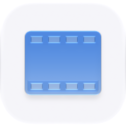
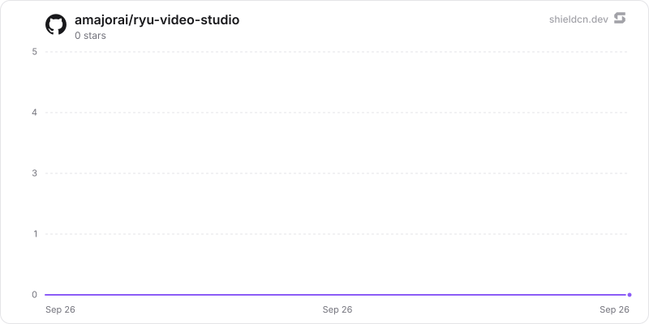

<p align="center">
  <picture>
    <source media="(prefers-color-scheme: dark)" srcset="./icon-dark.png" />
    
  </picture>
</p>

<div align="center">

# Video Studio

</div>

Edit layered video timelines, review storyboards, add timed captions, and render finished videos on a Ryu node.

> **The public home of `ryu-video-studio`.** Source, builds, and releases live here —
> binaries for every platform are attached to each release.
>
> This tree is generated from the Ryu monorepo, so commits pushed here
> directly are replaced on the next sync. **Pull requests are welcome** —
> open them here and they are ported into the monorepo, then flow back out.
> Ryu as a whole: https://github.com/amajorai/ryu

## Install

**App:** [Install](ryu://apps/@ryu/video-studio) (opens the Ryu desktop app and asks you to confirm)

**CLI:**

```bash
ryu apps add @ryu/video-studio
```

## Source & build

The **source of record** for this app: a dependency-free Bun/TypeScript
`sidecar/` Ryu runs locally as a grant-gated control capability, plus the
manifest `ui/`. The sidecar builds standalone — `cd sidecar && bun install &&
bun run build` compiles a single `ryu-video-studio` executable; each release attaches
the per-platform binaries.

## License

Apache-2.0 — see [LICENSE](./LICENSE).

## Build in the Ryu workspace

```sh
bun apps-store/video-studio/build.ts
```

This builds the Companion to `dist/index.html` and the native sidecar executable
under `sidecar/dist/`. Install the app through Ryu's normal package lifecycle.
The manifest's `RYU_VIDEO_STUDIO_BIN` override can point at the built sidecar for
a local development node. Core supplies the extension token and sidecar port.
The app is opt-in and does not require Shadow or Clips.

The node needs FFmpeg and ffprobe on PATH. Caption burn-in requires the subtitles
filter (libass). `RYU_VIDEO_STUDIO_FFMPEG` and `RYU_VIDEO_STUDIO_FFPROBE` can point
to explicitly installed binaries. The renderer only opens allowlisted media
formats from the app-owned library; it does not accept arbitrary command lines,
filter scripts, or output paths from clients.
Agents can import one local file, HTTPS URL, or bounded inline payload through
`POST /assets/import`; the sidecar probes it, copies it into app-owned storage,
and returns durable metadata before it can be placed on a timeline.
`GET /assets/:id/inspect` combines that metadata with any saved transcript,
source analysis, and thumbnail evidence for agent review.

Stock search covers Archive.org, Wikimedia Commons, NASA Images and Video,
keyless Openverse images/audio, node-configured Unsplash images, and optional
Pexels and Pixabay video catalogs. Unsplash, Pexels, and Pixabay access is
configured on the node; API credentials are never
exposed to the Companion, and unavailable configuration is reported instead of
falling back to another provider.

## Verification

```sh
bun test apps-store/video-studio/sidecar/src/studio.test.ts
bun apps-store/video-studio/sidecar/src/verify-codecs.ts
bun apps-store/video-studio/sidecar/src/verify-media.ts
bun apps-store/video-studio/verify-package.ts
bun run --cwd apps-store/video-studio/sidecar check-types
bun run --cwd apps-store/video-studio/ui check-types
bun run check:app-ui
```

The standalone media integration check generates a real video with audio,
imports it through the authenticated API, trims it, burns captions, renders an
MP4, checks its metadata and delivery review, and retrieves its bytes. It runs outside `bun test`
because Bun 1.3.14 on this macOS host returns empty subprocess output under its
test runner, including for `/bin/echo` and `ffprobe -version`.

For interactive verification of the compiled Companion with the real sidecar,
run `bun apps-store/video-studio/ui/e2e/proof-host.ts`, then open `http://127.0.0.1:5185`. This is a localhost test host using an isolated
`/tmp/ryu-video-studio-proof` library; it does not impersonate a live Ryu node or
provide fabricated generation results. The bridge is confined to the test host.

## Evidence and remaining scope

The requirement inventory and current limitations are tracked in the internal
`docs/video-editing-parity.md`. Full parity with the two reference products has
not yet been verified. No reference implementation, artwork, prompts, or skills
have been copied into this app.

### Native lifecycle verification

`ui/e2e/verify-core.ts` exercises an isolated Core install and enable path. It
requires the node's normal grant authority to approve the package. The current
unsigned local bundle is denied `sidecar:process`; this is an unresolved native
activation check, not a passing result. Do not use stub grant validation to hide
that denial. The compiled-service harness is independent evidence of the editor
and media engine, not a substitute for an approved native installation.

### Local speech proof

The optional Core speech harness uses the installed Homebrew whisper.cpp server
and a Whisper tiny.en model from the upstream whisper.cpp model repository. It
runs a real isolated Core transcription route and uses an OS sandbox that permits
loopback networking only, preventing unrelated first-run model downloads. It does
not change Gateway grants or make native Video Studio activation pass.

Prepare the spoken WAV fixture and model under the paths named by
`ui/e2e/core-speech-host.ts`, then run `bun apps-store/video-studio/ui/e2e/verify-speech.ts`.
For browser verification, set `RYU_VIDEO_STUDIO_PROOF_STT=1` when starting the
compiled-service `proof-host.ts`. The browser bridge then calls real Core speech
services. This harness is macOS-specific; it is not a product runtime dependency.

## Star History

<a href="https://github.com/amajorai/ryu-video-studio/stargazers">
  <picture>
    <source media="(prefers-color-scheme: dark)" srcset="./.github/shieldcn/star-chart-dark.svg" />
    
  </picture>
</a>
